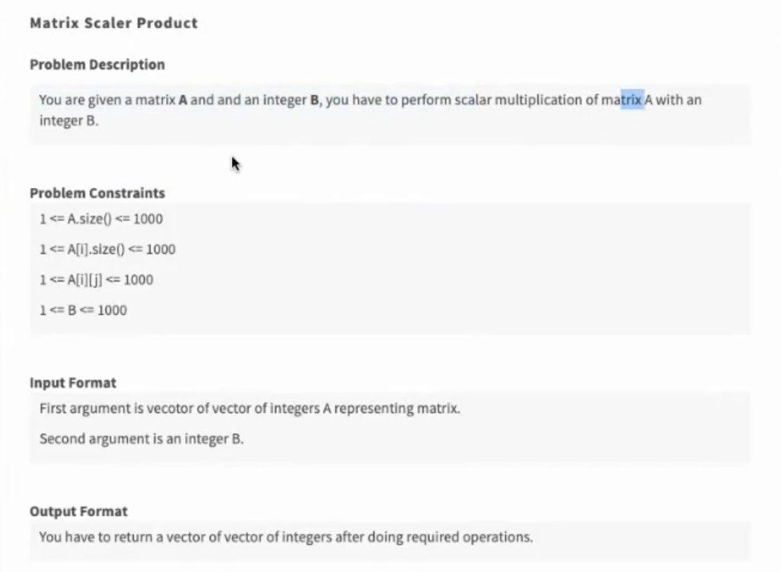
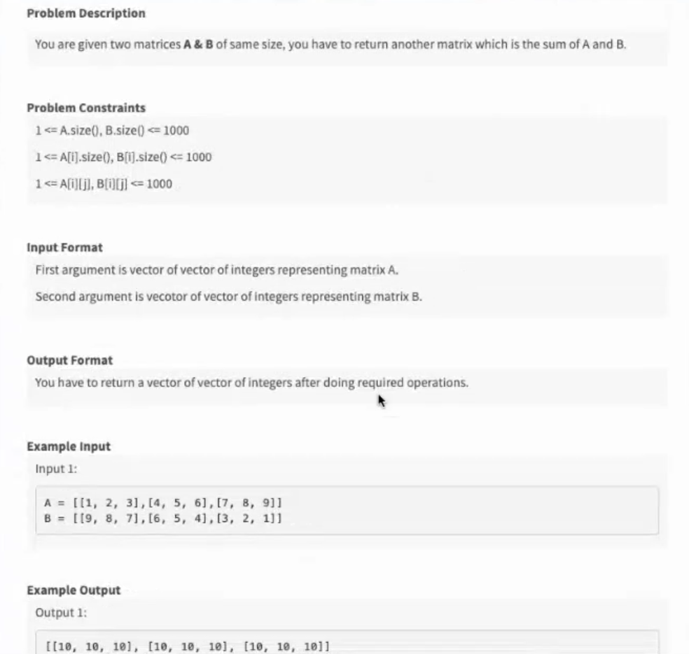

Problem 1 :



example : 

Input : A = [{1,2,3},{4,5,6},{7,8,9}]
        B = 2

Output : [{2,4,6},{8,10,12},{14,16,18}]

Solution :
```cpp
vector<vector<int>> Solution:: solve(vector<vector<int>> &A , int B) {
    //number of rows and columns
    int rows = A.size();
    int cols = A[0].size();

    for(int i = 0; i<rows ; i++) {
        for(int j = 0; j<cols ; j++) {
            A[i][j]=A[i][j]*B ;
        } 
    }

    return A;
}
```

Problem 2 :



