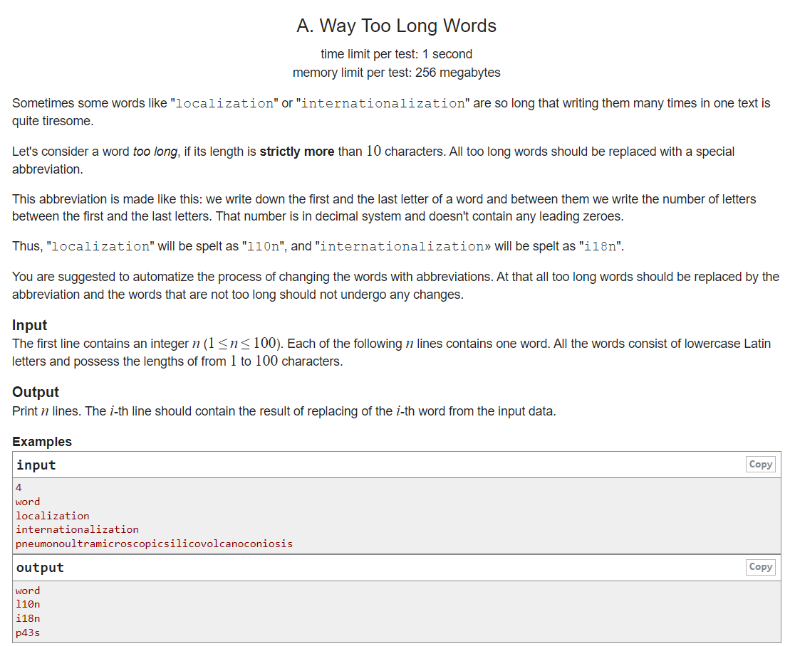
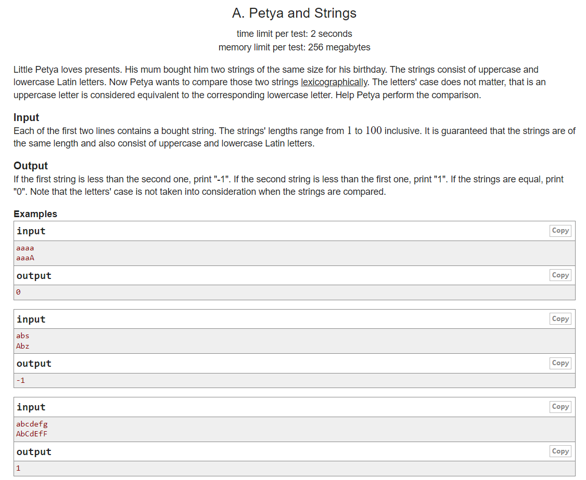

```cpp

#include <iostream>
#include <vector>
#include <algorithm>
#include <string>
#include <map>
#include <set>
#include <queue>
#include <stack>
using namespace std;

int main() {

    int tc;
    cin >> tc;

    while(tc--) {
        string s;
        cin >> s;

        int n = s.length();

        if(n > 10){
            cout << s[0] << n - 2 << s[n - 1] << endl;
        } else{
            cout << s << endl;
        }

    }

        return 0;
}

```



```cpp

#include <iostream>
#include <vector>
#include <algorithm>
#include <string>
#include <map>
#include <set>
#include <queue>
#include <stack>
using namespace std;

int main() {

    string a,b;
    cin >> a;
    cin >> b;

    for(int i = 0; i < a.length(); i++) {
        a[i] = tolower(a[i]);
        b[i] = tolower(b[i]);
    }

    if( a == b){
        cout << 0;
    }else if(a<b){
        cout << -1;
    }else{
        cout << 1;
    }

        return 0;
}

```

